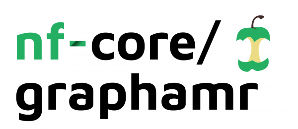

# 

**Antimicrobial Resistance Gene Detection from Metagenome Assembly Graphs**.

[](https://github.com/nf-core/graphamr/actions)
[](https://github.com/nf-core/graphamr/actions)
[](https://www.nextflow.io/)

[](https://bioconda.github.io/)
[](https://hub.docker.com/r/nfcore/graphamr)
[](https://nfcore.slack.com/channels/graphamr)

## Introduction

**nf-core/graphamr** is a bioinformatics best-practise analysis pipeline for recovery and identification of antibiotic resistance genes from fragmented metagenomic assemblies. The pipeline involves the alignment of profile hidden Markov models of target genes directly to the assembly graph of a metagenome with further dereplication and annotation of the results using state-of-the art tools. The pipeline supports reads or assembly graph as input. For reads the pipeline does quality control and assembles metagenome and builds graph.    

The pipeline is built using [Nextflow](https://www.nextflow.io), a workflow tool to run tasks across multiple compute infrastructures in a very portable manner. It comes with docker containers making installation trivial and results highly reproducible. The Nextflow DSL2 implementation of this pipeline uses one container per process which makes it much easier to maintain and update software dependencies.

## Quick Start

1. Install [`nextflow`](https://nf-co.re/usage/installation)

2. Install any of [`Docker`](https://docs.docker.com/engine/installation/), [`Singularity`](https://www.sylabs.io/guides/3.0/user-guide/) or [`Podman`](https://podman.io/) for full pipeline reproducibility _(please only use [`Conda`](https://conda.io/miniconda.html) as a last resort; see [docs](https://nf-co.re/usage/configuration#basic-configuration-profiles))_

3. Download the pipeline and test it on a minimal dataset with a single command:

    ```bash
    nextflow run nf-core/graphamr -profile test,<docker/singularity/conda>
    ```

    > Please check [nf-core/configs](https://github.com/nf-core/configs#documentation) to see if a custom config file to run nf-core pipelines already exists for your Institute. If so, you can simply use `-profile <institute>` in your command. This will enable either `docker` or `singularity` and set the appropriate execution settings for your local compute environment.

4. Start running your own analysis!
    > Typical command for analysis using reads:

    ```bash
    nextflow run nf-core/graphamr -profile <docker/singularity/podman/conda/institute> --reads '*_R{1,2}.fastq.gz' --hmm '*.HMM'
    ```

    > Typical command for analysis using graph:

    ```bash
    nextflow run nf-core/graphamr -profile <docker/singularity/podman/conda/institute> --graph '*.gfa' --hmm '*.HMM'
    ```


See [usage docs](https://nf-co.re/graphamr/usage) for all of the available options when running the pipeline.

## Pipeline Summary

Optionally, if raw reades are used:

<!-- TODO nf-core: Fill in short bullet-pointed list of default steps of pipeline -->

* Sequencing quality control (`FastQC`)
* Assembly metagenome and building graph (`metaSPAdes`)

By default, the pipeline currently performs the following:

* Aligning HMM profile to graph (`Pathracer`)
* Detection and clustering ORFs (`MMseqs2`)
* Annotation representative sequences (`Abricate, RGI, sraX`)


## Documentation

The nf-core/graphamr pipeline comes with documentation about the pipeline: [usage](https://nf-co.re/graphamr/usage) and [output](https://nf-co.re/graphamr/output).

<!-- TODO nf-core: Add a brief overview of what the pipeline does and how it works -->

## Credits

nf-core/graphamr was originally written by Daria Shafranskaya, Anton Korobeynikov.

We thank the following people for their extensive assistance in the development
of this pipeline:

<!-- TODO nf-core: If applicable, make list of people who have also contributed -->

## Contributions and Support

If you would like to contribute to this pipeline, please see the [contributing guidelines](.github/CONTRIBUTING.md).

For further information or help, don't hesitate to get in touch on the [Slack `#graphamr` channel](https://nfcore.slack.com/channels/graphamr) (you can join with [this invite](https://nf-co.re/join/slack)).

## Citations

<!-- TODO nf-core: Add citation for pipeline after first release. Uncomment lines below and update Zenodo doi. -->
<!-- If you use  nf-core/graphamr for your analysis, please cite it using the following doi: [10.5281/zenodo.XXXXXX](https://doi.org/10.5281/zenodo.XXXXXX) -->

You can cite the `nf-core` publication as follows:
